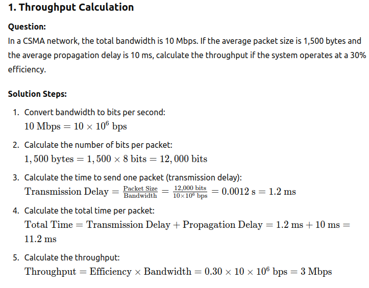
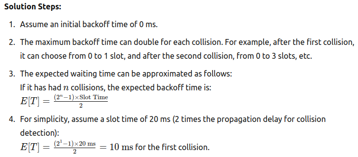

# Carrier Sense Multiple Access (CSMA)

Here are some numerical questions related to Carrier Sense Multiple Access (`CSMA`), particularly focusing on concepts like delay, throughput, and efficiency.

## 1. Throughput Calculation

## 2. Average Waiting Time

**Question:**
In a CSMA/CD network, the propagation delay between two nodes is 15 ms. If a node sends a packet and then has to wait due to collisions, what is the average waiting time for a subsequent attempt, assuming it uses exponential backoff?

## 3. Network Efficiency

**Question:**

If a `CSMA/CD` network has a propagation delay of 2 ms and a transmission delay of 8 ms, calculate the efficiency of the network if the load is 50%.

**Solution Steps:**

1. Calculate the round-trip time (`RTT`):

RTT = 2×Propagation Delay = 2×2 ms = 4ms

2. Calculate the total time for one packet to be sent and acknowledged:

Total Time=Transmission Delay+RTT=8 ms+4 ms=12 ms

3. The efficiency (E) can be calculated as:

   E=Total TimeTransmission Time​=12 ms8 ms​≈0.67 or 67%

## 4. Maximum Packet Size Calculation

**Question:**

In a CSMA/CA network, if the channel bandwidth is 2 Mbps and the propagation delay is 5 ms, what is the maximum packet size that can be sent without causing a collision, assuming the round-trip time is 20 ms?
