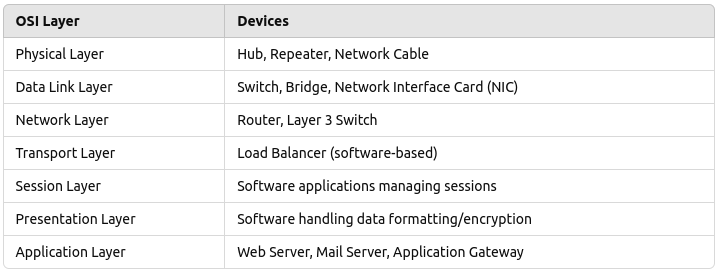

# Table of Layer-wise Devices

### 1. Physical Layer (Layer 1)

**Devices:**

- `Hub`: Connects multiple Ethernet devices, making them act as a single network segment. `Hubs transmit data to all connected devices`.
- `Repeater`: Regenerates and amplifies signals to extend the distance of a network.
- `Network Cable`: (e.g., Ethernet, fiber optic) used for physical connections.

