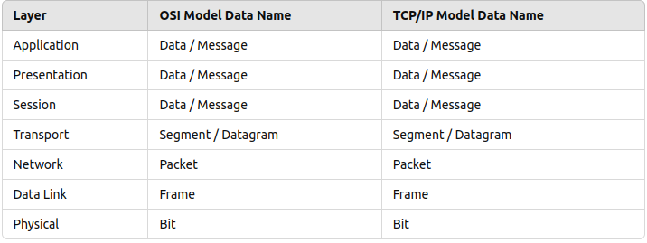

# OSI

In networking, data is encapsulated at different layers of the `OSI (Open Systems Interconnection)` model and the TCP/IP model. Each layer has its own name for the data it handles.

## OSI Model Data Names

### 7 Application Layer (Layer 7):

    - Data Name: `Data` (or `Message`)
    - This is the layer where user-level protocols operate (e.g., `HTTP`, `FTP`).

### 6 Presentation Layer (Layer 6):

    - Data Name: `Data` (or `Message`)

    - Responsible for `data formatting`, `encryption`, and `compression`.

### 5 Session Layer (Layer 5):

    - Data Name: `Data` (or `Message`)
    - Manages `sessions` between applications.

### 4 Transport Layer (Layer 4):

    - Data Name: `Segment` (for `TCP`) or `Datagram` (for `UDP`)
    - Provides `end-to-end communication` and `error recovery`.

### 3 Network Layer (Layer 3):

    - Data Name: `Packet`
    - Handles `routing of data` across multiple networks.

### 2 Data Link Layer (Layer 2):

    - Data Name: `Frame`
    - Responsible for `node-to-node data transfer` and `error detection`.

### 1 Physical Layer (Layer 1):

    - Data Name: `Bit`
    - Deals with the `transmission of raw binary` data over physical media.
